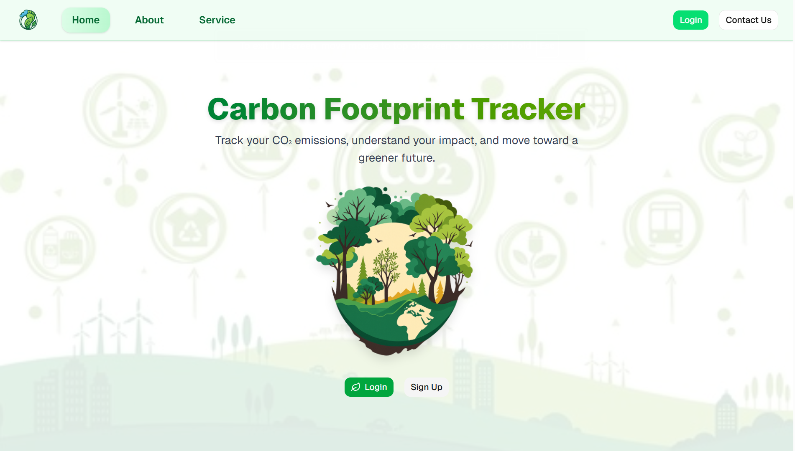
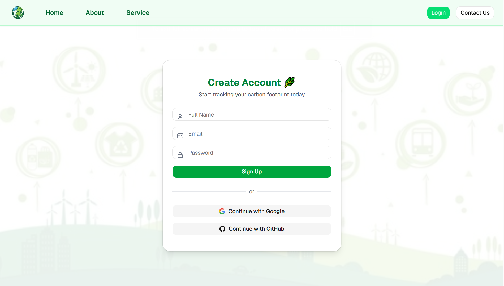
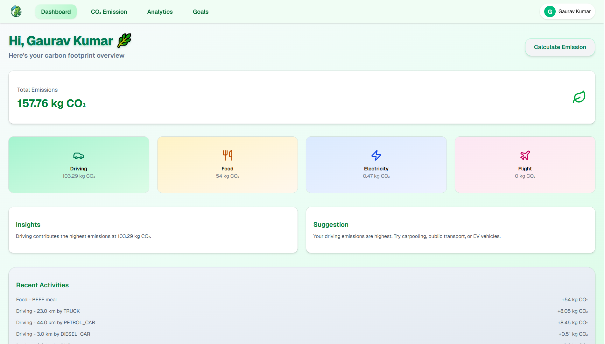
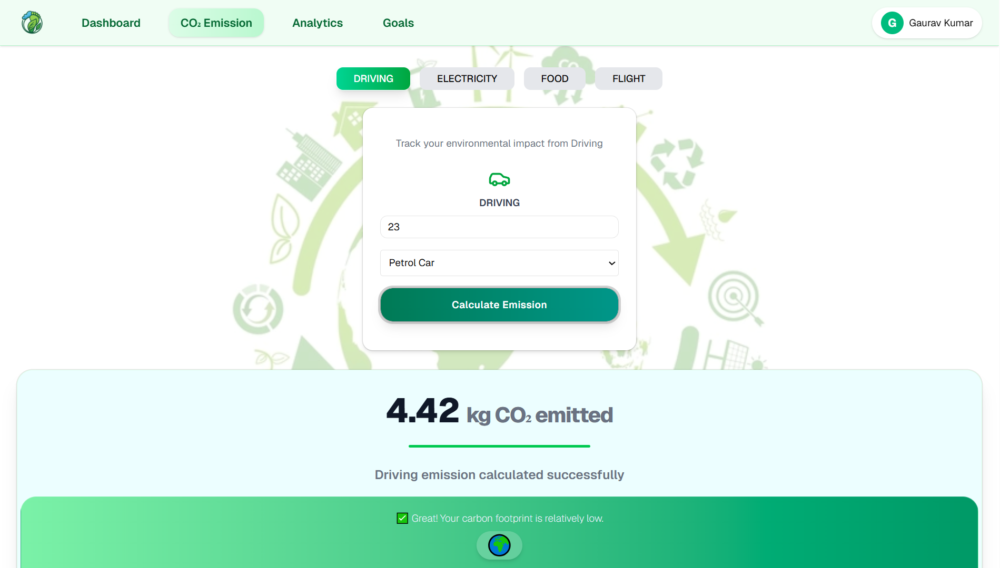
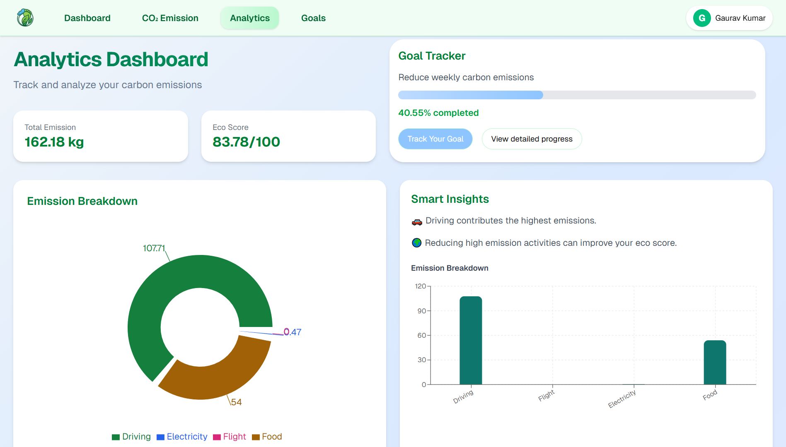
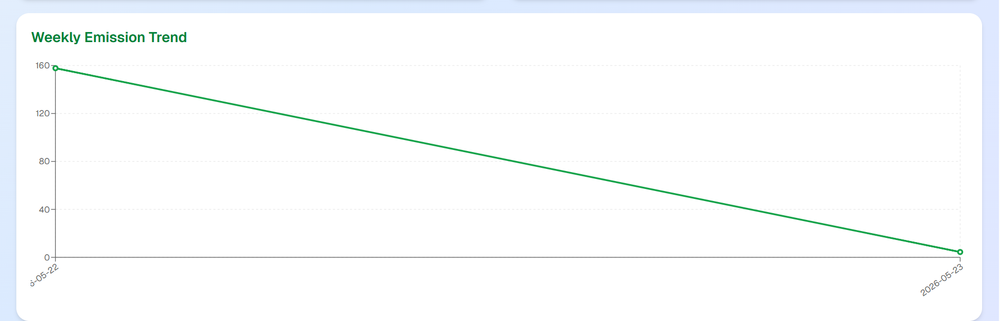
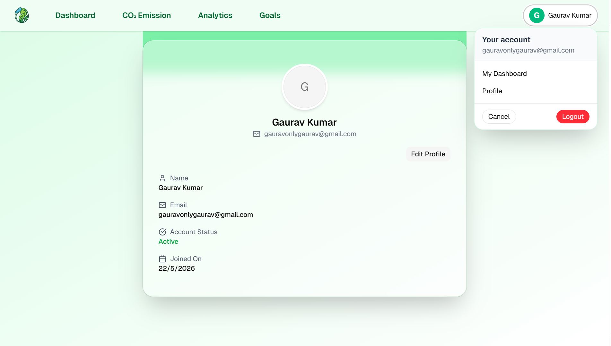

<<<<<<< HEAD

# 🌱 Carbon Footprint Tracker

=======

# 🌱 Carbon Footprint Tracker

>>>>>>> c97346815f9753148af94a0de5f08afdca6fb455
A **production-style full-stack web application** that helps users track, analyze, and reduce their carbon emission based on daily activities such as driving co2 emission, electricity usage, food consumption, and flights.

Built using **React, TypeScript, Spring Boot, Spring Security, JWT, OAuth2, Docker and MySQL**, this project demonstrates real-world full-stack engineering, secure authentication, and custom backend business logic for carbon emission calculation.

<<<<<<< HEAD
----
=======
---
>>>>>>> c97346815f9753148af94a0de5f08afdca6fb455

## 🚀 Key Features

### 🔐 Authentication & Security
- User registration and login system  
- Google OAuth2 authentication  
- GitHub OAuth2 authentication
- Protected frontend routes
- Spring Security backend protection
- Password encryption using BCrypt

### 🌍 Carbon Emission Tracking
- Driving CO₂ emission calculation (custom logic)  
- Electricity usage emission tracking  
- Food consumption emission calculation  
- Flight emission tracking  
- Automatic CO₂ calculation engine (no external API dependency)

### 📊 Dashboard & Analytics
- Total carbon footprint overview  
- Activity-wise emission breakdown
- Weekly emission trends
- Interactive charts and analytics  
- Goal tracking system

### ⚡ Full-Stack Features
- Real-time API communication (with Axios)
- Secure token-based API calls
- Responsive UI for all devices
- Clean separation of frontend & backend  

<<<<<<< HEAD
----
=======
---
>>>>>>> c97346815f9753148af94a0de5f08afdca6fb455

## 📸 Screenshots

### Home Page
<<<<<<< HEAD

### Signup Page

### Dashboard

### Emission Calculation

### Analytics

### Goal Tracking

### Profile View

### Live Demo

----
=======

### Signup Page

### Dashboard

### Emission Calculation

### Analytics

### Goal Tracking

### Demo

---
>>>>>>> c97346815f9753148af94a0de5f08afdca6fb455

## 🧠 System Architecture

[Frontend (React + TypeScript)]-> [Axios API Calls]-> [Spring Boot Backend
API]-> [JWT Authentication Filter]-> [Business Logic]-> [MySQL Database]

### Flow Explanation
- The frontend communicates with the backend using secure REST APIs built with Spring Boot
- Every protected request includes a JWT access token in the Authorization header
- The JWT Authentication Filter validates the token before allowing access to any secured endpoint
- Once authenticated, the request moves to the Carbon Calculation Engine, where CO₂ emissions are calculated based on activity type (driving, electricity, food, etc.)
- The calculated emission data is then stored in the MySQL database for history, analytics, and dashboard visualization
- The backend sends a structured response back to the frontend, which updates the UI in real time

<<<<<<< HEAD
----
=======
---
>>>>>>> c97346815f9753148af94a0de5f08afdca6fb455

## 🛠️ Tech Stack

### Frontend
- React (TypeScript)  
- Tailwind CSS
- Tailwind CSS
- Axios
- React Router
- Recharts (Charts & Analytics)  

### Backend
- Java 21
- Spring Boot 
- Spring Security 
- JWT Authentication  
- OAuth2 (Google & GitHub)  
- JPA / Hibernate  
- MySQL 

<<<<<<< HEAD
----
=======
---
>>>>>>> c97346815f9753148af94a0de5f08afdca6fb455

## 📂 Project Structure

### Backend
- controller → REST APIs
- service → Business logic (carbon calculations)
- repository → Database layer
- entity → Database models
- dto's → Request/Response models
- security → JWT configuration
- exception → Global exception handling

### Frontend
- components → UI components
- pages → Application pages
- services → API calls (Axios)
- store -> Zustand Store
- charts → Analytics components

<<<<<<< HEAD
----
=======
---
>>>>>>> c97346815f9753148af94a0de5f08afdca6fb455

## 🚀 Setup & Run

### 1️⃣ Clone Repository

git clone https://github.com/gauravonlygaurav1/carbon-footprint-tracker
cd carbon-footprint-tracker

### 2️⃣ Backend Setup

cd carbon_tracker_backend
mvn spring-boot:run

Configure DB in application-dev.yml

### 3️⃣ Frontend Setup

cd carbon_tracker_frontend
npm install
npm run dev

Frontend runs on: http://localhost:5173

<<<<<<< HEAD
----

## 🌐 Live Demo

**Frontend:** https://carbon-footprint-tacker.netlify.app/

**Backend:** https://carbon-footprint-tracker-iyh1.onrender.com

----
=======
---

## 🌐 Live Demo

**Frontend:** 

**Backend:**

---
>>>>>>> c97346815f9753148af94a0de5f08afdca6fb455

## 🎯 Future Improvements

- AI-based carbon reduction suggestions
- Leaderboard system (gamification)
- Mobile app (React Native)
- Cloud deployment (AWS)
- Social sharing of progress

<<<<<<< HEAD
----
=======
---
>>>>>>> c97346815f9753148af94a0de5f08afdca6fb455

## 👨‍💻 Author

**Gaurav**
<<<<<<< HEAD

**Java Full-Stack Developer**

**Spring Boot • React • System Design**
=======
**Java Full-Stack Developer**
**Spring Boot • React • System Design**
>>>>>>> c97346815f9753148af94a0de5f08afdca6fb455
